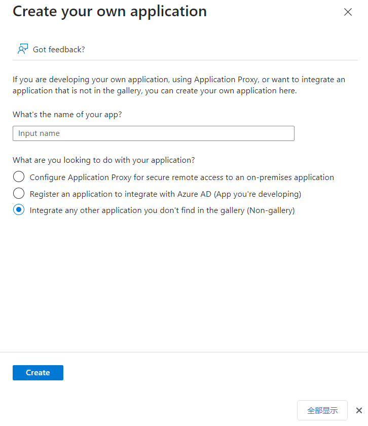
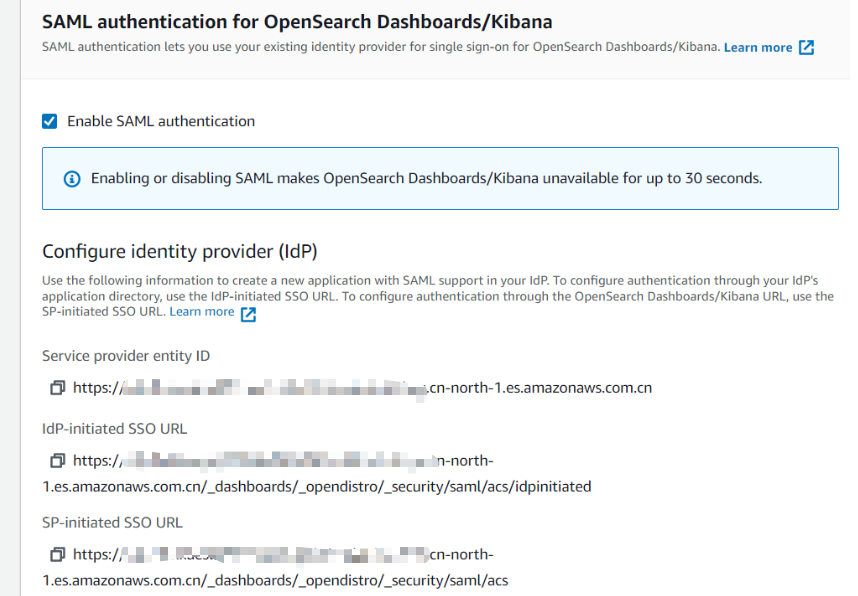
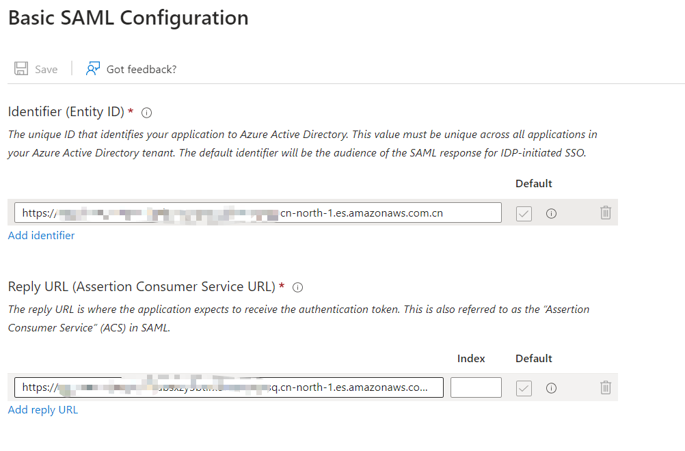
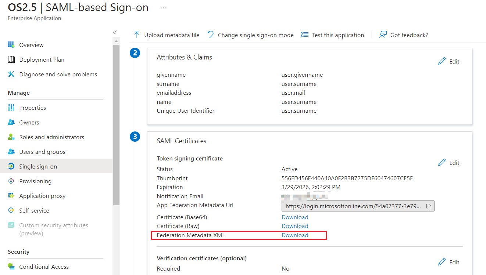
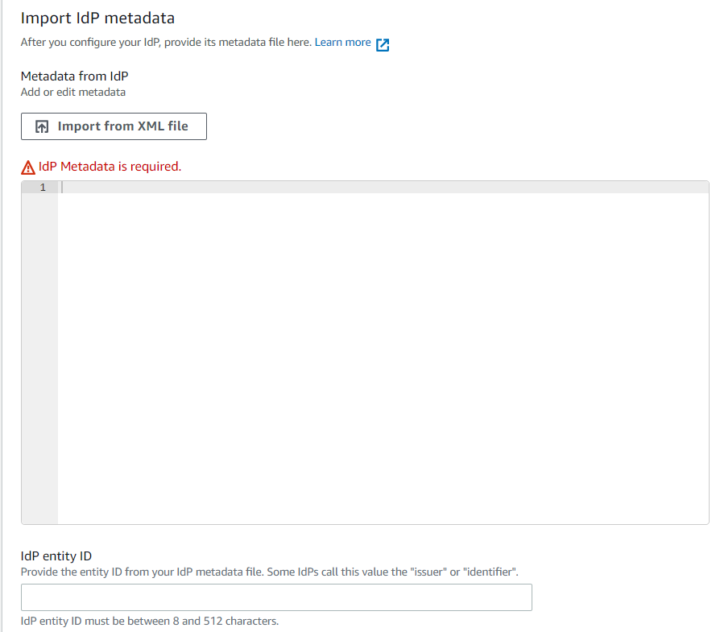
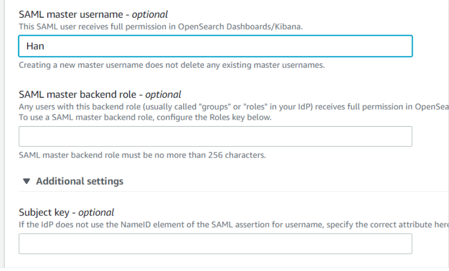

## AAD 使用SAML登录OpenSearch

Azure AD的配置如下：

1. 登录 Global Azure 控制台，选择并切换至 Azure Active Directory 服务，在左侧的侧边栏选择 Enterprise applications，All Applications 页面点击 New application. 

2.  选择 Create your own application，命名，点击 Create 完成创建。

   

3. 点击左侧侧边栏的 Single Sign-on, 选择 SAML。

4. 编辑 Basic SAML Configuration,将 Identifier (Entity ID) 和 Reply URL (Assertion Consumer Service URL)地址分别配置为下图的Service provider entity ID和SP-initiated SSO URL中，其他设置保持默认即可.

这里可能要更改一些信息，比如Attributes & Claims中的name，因为邮箱登录默认的名字是带有特殊字符的，所以我这里使用user.surname，也可以使用固定的字符串进行设定。 配置完毕后，需要导出AAD的XML文件，然后上传到OpenSearch中，这个XML中会包含IDP的一系列信息。

5. 在 SAML Singing Certificate 页面请确保有 Active 的证书，如果没有请点击 Edit 申请证书并激活。确保激活后下载 Federation Metadata XML，IdP entity ID会自动填充，此文件将用户在亚马逊云科技中国区域OpenSearch创建身份提供商 IDP.

6. 切换至 Azure 管理控制台并进去 Azure Active Directory 页面，点击左侧侧边栏的 User 页面，点击创建用户, 输入用户名和邮箱地址等并完成用户创建。

7. 返回至 Azure Active Directory 主页面，左侧侧边栏选择 Enterprise Applications 并切换到创建的应用下, 点击侧边栏的 Users and groups 或者点击中间页面的 Assign users and groups 图标。 
8. 添加用户，选择 Azure Active Directory 中的之前创建的用户并关联至亚马逊云科技中国区域的OpenSearch中。我们这里将当前用户关联至我们之前创建的Attributes & Claims中的name，同时在SAML master username 填写这个名字，在我的环境中是Han。 
9. 再次切换至应用程序页面，点击 Test Single sign-on with AWS China 选项中的 Test 按钮，使用当前用户登录即可完成 SSO 登录。

